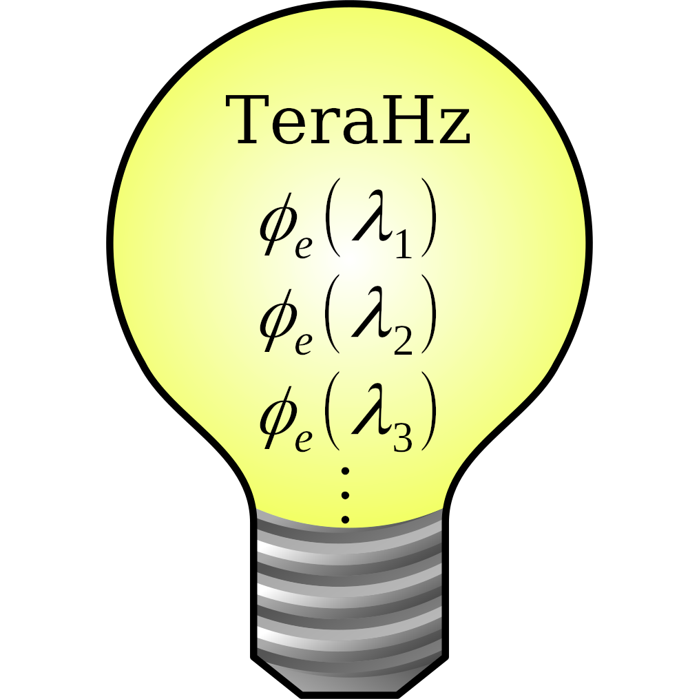

#  TeraHz

*Za slovensko različico se odpravite na <http://git.sckr-lab.tk/kristjank/TeraHz>*

TeraHz is a low-cost portable spectrometer based on Raspberry Pi and a few
commonly available sensor breakout boards. It's designed to bring low-cost
scientific exploration of the light spectrum to educational institutions that
cannot afford the options available on the current market. It costs less than
200€ with money to spare and uses only free, libre and open-source software
(FLOSS). It is free to use under the ISC license, a spiritual successor to the
classic 3-clause BSD license.

## How to install
Stable releases are available under the releases tab and can be installed either
by flashing a **preinstalled** ready to boot image with a stable version of
TeraHz preinstalled or by flashing a **preconfigured** image of DietPi and
installing TeraHz manually, which is useful if you want to test bleeding edge
releases. For more information, check out the [Build
guide](https://terahz.readthedocs.io/en/latest/build/).

## Docs
TeraHz usually works out of the box. A wireless network named `TeraHz_XXXXXX`
(XXXXXX = the last half of the MAC address) will appear. Password is
`terahertz`. After connection, open a web browser and visit `terahz.site`.
The UI will appear. To fetch data from the sensors, press the 'Get Data' button.
The readings are then plotted and written into the tables below the graph.

More documentation is available at <https://terahz.readthedocs.io>

## Development team
- Kristjan Komloši (cls-02) - Project leader and main programmer
- Jakob Kosec (D3m1j4ck) - Frontend designer
- Juš Dolžan (ANormalPerson) - Math double-checker
